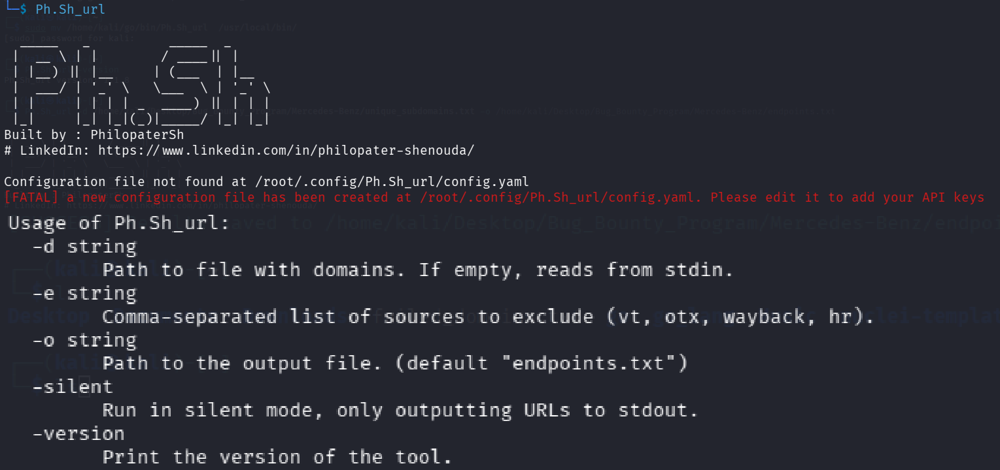

# Ph.Sh_URL - Reconnaissance and URL Collection Tool

<div align="center">



<br>

<a href="https://youtu.be/C0rkldC5j_I"></a>

## 📖 About The Tool

`Ph.Sh_URL` is a powerful and concurrent open-source intelligence (OSINT) tool built with Go. It is designed for security researchers, penetration testers, and bug bounty hunters to automate the process of URL discovery. The tool systematically queries multiple online sources to gather a comprehensive list of URLs associated with one or more target domains, helping to uncover a wider attack surface.

### Connect with me:
<a href="https://www.linkedin.com/in/philopater-shenouda/"></a>
<a href="https://twitter.com/PhilopaterSh"></a>
<a href="https://medium.com/@PhilopaterSh"></a>

</div>

## 📜 Table of Contents

- [🛠️ Technology Stack](#️-technology-stack)
- [✨ Features](#-features)
- [🚀 What's New in v1.1.8](#-whats-new-in-v118)
- [🎨 Colored Output](#-colored-output)
- [📈 Progress and Timer](#-progress-and-timer)
- [🚦 Graceful Shutdown](#-graceful-shutdown)
- [💾 Logging, Resuming, and File Writing](#-logging-resuming-and-file-writing)
- [📚 Data Sources](#-data-sources)
- [🛠️ Setup and Usage](#️-setup-and-usage)
- [👨‍💻 How to Use](#-how-to-use)
- [📋 Results](#-results)
- [🔄 Updating the Tool](#-updating-the-tool)

## 🛠️ Technology Stack

<div align="center">


</div>

## ✨ Features

- **Multiple Sources**: Gathers data from 4 different sources to ensure broad coverage.
- **High Performance**: Utilizes Go's Goroutines technology to execute searches in parallel for different sources *within a single domain*, providing superior speed for each domain's lookup.
- **Flexible Input/Output**: Supports reading domains from a file or standard input (stdin), and allows specifying the output file.
- **Flexible Key Management**: Relies on a `config.yaml` file for API key management.
- **Automatic Setup**: The tool automatically creates its configuration file when needed.
- **Silent Mode**: The `-silent` option prints only URLs, ideal for scripting. When not in silent mode, logging output is concise, without timestamps, with simplified source-specific messages, and includes a domain counter (e.g., `Processing domain 5/100: example.com`).
- **Clean Results**: Deduplicates found URLs and saves them to a single text file. Also, performs enhanced validation and cleaning of input domains, skipping invalid ones with a warning.
- **Stateful Resumption**: The tool saves its progress and, upon restart, resumes from where it left off without overwriting previously found URLs, ensuring that results from multiple sessions are merged.

## 🚀 What's New in v1.1.8

- **Enhanced Resumption Logic**: The tool's ability to resume after an interruption has been tested and confirmed. If the process is stopped, it will now reliably continue from the last successfully processed domain upon restart.
- **Clarified Output File Behavior**: The tool's file-writing logic has been clarified. It is designed to produce a **complete and unique** list of URLs. At the end of each session (or upon interruption), it loads all previously found URLs, merges them with new findings, removes duplicates, and then **overwrites** the output file with the complete, clean list. This ensures you always have a comprehensive and de-duplicated dataset without manual cleanup.
- **Version Bump**: The official version is now `1.1.8`.

## 🎨 Colored Output

`Ph.Sh_URL` now uses colored output to make the logs more readable. The colors are used to indicate the status of the different operations:

- **Green**: Success messages.
- **Red**: Error messages.
- **Yellow**: Warning messages.
- **Blue**: Informational messages.

Here is an example of the new output:

```
[INFO] Loaded 3 domains.
[INFO] Processing domain 1/3 (33.33%): google.com
[OTX] Found 50000 URLs
[VT] Found 0 URLs
[Wayback] Found 3 URLs
[HudsonRock] Found 0 URLs
[INFO] Waiting for 20s before next domain. Estimated time remaining: 40s
[INFO] Processing domain 2/3 (66.67%): example.com
```

## 📈 Progress and Timer

To enhance user experience, `Ph.Sh_URL` now includes:

-   **Progress Percentage**: Displays the completion percentage as it processes domains.
-   **Estimated Time Remaining**: Shows an estimated time until all domains are processed.

Example of the new progress indication:
```
[INFO] Processing domain 1/3 (33.33%): google.com
...
[INFO] Waiting for 20s before next domain. Estimated time remaining: 40s
[INFO] Processing domain 2/3 (66.67%): example.com
...
```

## 🚦 Graceful Shutdown

`Ph.Sh_URL` supports graceful shutdown. If you interrupt the process (e.g., by pressing `Ctrl+C`), the tool will automatically save all the URLs found up to that point to the output file before exiting. This ensures that you don't lose any data even if you stop the scan midway.

## 💾 Logging, Resuming, and File Writing

`Ph.Sh_URL` is designed to be resilient and prevent data loss between sessions.

### Logging and Resuming
The tool logs its progress by saving the last successfully processed domain to a log file (`Ph.Sh_URL.log`). If the script is interrupted, it can be restarted and will automatically resume from the next domain in the list. Once the entire process is complete, the log file is automatically deleted.

### Output File Handling
To ensure a clean and unique final list, the tool follows a specific procedure for writing to the output file (e.g., `endpoints.txt`):
1.  **Load Existing Data**: At startup, the tool reads all URLs from the existing output file into memory.
2.  **Gather New Data**: It then processes the domains and collects new URLs.
3.  **Merge and De-duplicate**: All URLs (old and new) are merged, and duplicates are removed.
4.  **Overwrite with Complete Set**: Finally, the tool **overwrites** the output file with the complete, unique set of URLs.

This process guarantees that even if you stop and start the tool multiple times, you will not lose any data. The final output file will always contain a comprehensive, de-duplicated collection of all URLs found across all runs.

## 📚 Data Sources

The tool relies on the following sources:

1.  **VirusTotal**: Requires an API key.
2.  **AlienVault OTX**: Works without a key, but using one is preferred for better results.
3.  **The Wayback Machine**: Works without a key.
4.  **Hudson Rock**: Requires an API key for full data. If no API key is provided, the tool will attempt to fetch data but will filter out common redacted/encrypted URL patterns.

---

## 🛠️ Setup and Usage

### 1. First-time Setup

When running the tool for the first time, it will look for a configuration file. If not found, it will automatically create one in the following path:
- **On Linux:** `~/.config/Ph.Sh_URL/config.yaml`
- **On Windows:** `C:\Users\YourUser\.config\Ph.Sh_URL\config.yaml`

The tool will then stop and ask you to edit this file. Open the file and add your API keys in the designated sections.

```yaml
# Configuration file for Ph.Sh_URL
virustotal:
  - "YOUR_VT_API_KEY_1"

alienvault:
  - "YOUR_OTX_API_KEY_1"

hudsonrock:
  - "YOUR_HUDSONROCK_API_KEY_1"
```

### 2. Installation

There are two ways to install `Ph.Sh_URL`. The recommended method is to build from the source, as it guarantees you are using the latest version.

**Method 1: Build from Source (Recommended)**

This method avoids potential caching issues with Go's module proxy and ensures you have the most up-to-date version.

**Step 1: Clone the Repository**

First, clone the GitHub repository to your local machine:
```bash
git clone https://github.com/PhilopaterSh/Ph.Sh_url.git
```

**Step 2: Navigate to the Directory**

Go into the cloned directory:
```bash
cd Ph.Sh_url
```

**Step 3: Build the Tool**

Next, build the tool using the `go build` command. This will create a binary named `Ph.Sh_url` (or `Ph.Sh_url.exe` on Windows) in the current directory.
```bash
go build
```

**Step 4: Verify the Version**

After building, verify that you have the latest version by running:
```bash
./Ph.Sh_url -version
```

## 🙏 Support My Work

If you find my work useful, please consider supporting me. It helps me to dedicate more time to open-source projects.

<div align="center">

[](https://www.buymeacoffee.com/PhilopaterSh)

</div>
The output should match the latest version listed in the [release notes](https://github.com/PhilopaterSh/Ph.Sh_url/releases).

**Step 5: Make it Globally Accessible (Optional)**

To run `Ph.Sh_url` from any directory, move the binary to a directory in your system's `PATH`. For example, on Linux or macOS:
```bash
sudo mv Ph.Sh_url /usr/local/bin/
```
On Windows, you can move `Ph.Sh_url.exe` to a folder that is included in your `Path` environment variable.

**Method 2: Using `go install` (Alternative)**

This method is faster but may install an outdated version due to caching in Go's module proxy. If you encounter issues, please use the "Build from Source" method instead.

To install, run the following command:
```bash
go install github.com/PhilopaterSh/Ph.Sh_url@latest
```

If `go install` fetches an older version, you can try to bypass the proxy cache with the following command. However, this is not guaranteed to work.
```bash
GOPRIVATE=github.com/PhilopaterSh/Ph.Sh_url go install github.com/PhilopaterSh/Ph.Sh_url@latest
```

After installation, the binary will be located in your `$GOPATH/bin` directory. You may need to move it to a globally accessible location, as shown in "Step 5" of the recommended method.

### 3. How to Use

`Ph.Sh_URL` is designed to be flexible, allowing you to provide target domains either through a file or directly via standard input (stdin).

### Command-Line Options

| Flag      | Description                                                                                                  | Example                                               |
| --------- | ------------------------------------------------------------------------------------------------------------ | ----------------------------------------------------- |
| `-d`      | Provide a file containing a list of domains, one per line.                                                   | `./Ph.Sh_url -d domains.txt`                          |
| `-o`      | Specify a custom output file for the results. (Default: `endpoints.txt`)                                     | `./Ph.Sh_url -d domains.txt -o my_urls.txt`           |
| `-silent` | Suppress all informational and error messages, printing only the discovered URLs to standard output.         | `./Ph.Sh_url -d domains.txt -silent > found_urls.txt` |
| `-e`      | Exclude specific data sources (comma-separated: `vt`, `otx`, `wayback`, `hr`).                                | `./Ph.Sh_url -d domains.txt -e vt,hr`                 |
| `-version`| Display the installed version of `Ph.Sh_URL`.                                                                | `./Ph.Sh_url -version`                                |

### Full Example

```bash
# Process domains from 'targets.txt', exclude Wayback Machine, save results to 'output_urls.txt', and run silently
./Ph.Sh_url -d targets.txt -e wayback -o output_urls.txt -silent
```

## 📋 Results

The tool saves the list of unique URLs in the file you specify via the `-o` option, or in `endpoints.txt` by default.

## 🔄 Updating the Tool

To update `Ph.Sh_url` to the latest version, simply run the `go install` command again:

```bash
go install github.com/PhilopaterSh/Ph.Sh_url@latest
```

This will download and compile the newest version, replacing your old executable. The tool's version, defined in `main.go`, should be incremented with each significant update or improvement.

To check the currently installed version, use the `-version` flag:

```bash
Ph.Sh_url -version
```